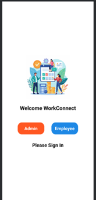
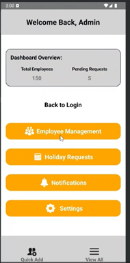
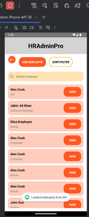
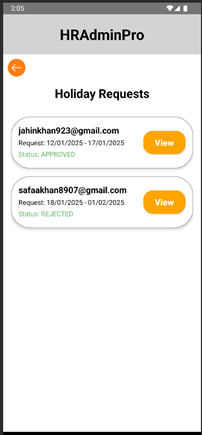

# 📋 Employee Management System App

This project is a mobile application designed to streamline administrative tasks, such as managing employee data and handling holiday requests. Built for Android, the app provides a user-friendly interface with robust features, including employee record management, holiday request approvals, and customizable notifications. This README offers an overview of the app, installation steps, key features, and technical details.

---

## 📜 Table of Contents
- [Features](#features)
- [Installation](#installation)
- [Technologies Used](#technologies-used)
- [API Endpoints](#api-endpoints)
- [Database Details](#database-details)
- [Screenshots](#screenshots)
- [GitHub Repository](#github-repository)
- [Acknowledgments](#acknowledgments)
- [Future Enhancements](#future-enhancements)

---

## 🌟 Features

### Admin Functionalities:
- 👤 **Login and Authentication**:
  - Secure login with username and password.
- 📂 **Employee Management**:
  - Add, view, edit, and delete employee records.
  - Fetch employee details by ID.
- 📅 **Holiday Requests**:
  - Approve or reject holiday requests.
  - View pending and processed requests.
- 🔔 **Notifications**:
  - Notify users of request statuses and updates.
- ⚙️ **Settings**:
  - Manage notification preferences and account settings.

### Offline Capabilities:
- 🗂️ **SQLite Database**:
  - Local storage for login credentials and holiday requests, ensuring offline functionality.

---

## 🛠️ Installation

### Prerequisites:
1. **Android Studio** (latest version).
2. **Java Development Kit (JDK)** 8 or higher installed on your system.

### Installation Steps:
1. Clone the repository:
   ```bash
   git clone https://github.com/Ali34f/Application2.git
   ```
2. Open the project in **Android Studio**.
3. Build and sync the project to resolve dependencies.
4. Run the app on an emulator or a connected physical Android device.

---

## 💻 Technologies Used

- **Android Studio**: IDE for app development.
- **Java**: Core programming language for backend logic.
- **SQLite**: Local database for offline functionality.
- **Postman**: API testing and validation tool.

---

## 🌐 API Endpoints

The app integrates with a RESTful API for managing employee data. Below is an overview of the key API endpoints:

| **Method** | **Endpoint**           | **Description**                     |
|------------|------------------------|-------------------------------------|
| `GET`      | `/employees`           | Fetch all employee records.         |
| `GET`      | `/employees/{id}`      | Fetch employee details by ID.       |
| `POST`     | `/employees`           | Add a new employee record.          |
| `PUT`      | `/employees/{id}`      | Update an employee's details.       |
| `DELETE`   | `/employees/{id}`      | Delete an employee record.          |

All endpoints were rigorously tested using **Postman** to ensure seamless functionality and data integrity.

---

## 💾 Database Details

The app uses an SQLite database for offline data storage. Below is an overview of the schema:

### SQLite Schema:

| **Table**          | **Column**        | **Type**    |
|--------------------|-------------------|-------------|
| `Login`           | `username`        | `TEXT`      |
|                   | `password`        | `TEXT`      |
| `HolidayRequests` | `id`              | `INTEGER`   |
|                   | `employee_id`     | `INTEGER`   |
|                   | `start_date`      | `DATE`      |
|                   | `end_date`        | `DATE`      |

---

## 📸 Screenshots

Below are screenshots illustrating the app’s key functionalities:

### Login Screen:


### Admin Dashboard:


### Employee Management:


### Holiday Requests:



---

## 🔗 GitHub Repository

The complete source code for this project is hosted on GitHub and can be accessed using the link below:

🔗 [GitHub Repository](https://github.com/Ali34f/Application2)

---

## 🤝 Acknowledgments

Special thanks to:
- **University Team** for their invaluable guidance throughout the project.
- **Peers** for providing feedback and support.

---

## 🚀 Future Enhancements

- Add a **search functionality** for employee management.
- Introduce **advanced analytics** to track employee performance.
- Optimize the app for **multi-platform compatibility** (e.g., iOS).

---
